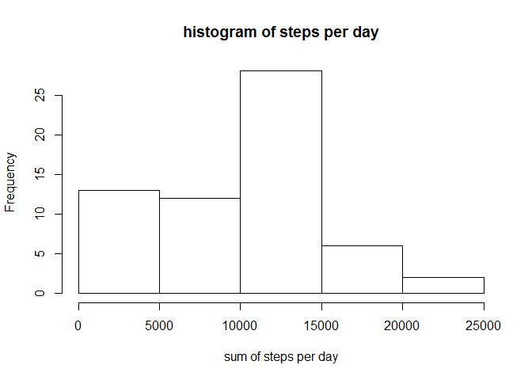
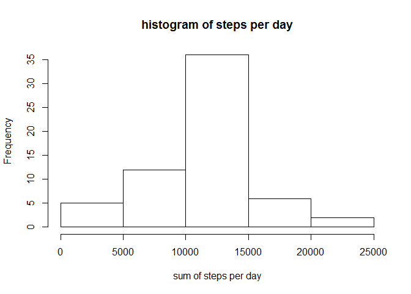

# Reproducible Research: Peer Assessment 1

## Loading and preprocessing the data

Data extracted from activity.csv stored in directory

```r
echo = TRUE
activity <- NULL
activity <- read.csv("activity.csv", header = T, sep = ",")
```

Variables set to NULL

```r
echo = TRUE
df_summary <- NULL
stepsum2 <- NULL
stepsum <- NULL
mn_int <- NULL
activity2 <- NULL
mean_stepsum2 <- NULL
median_stepsum2 <- NULL
activity2_weekend <- NULL
activity2_weekday <- NULL
mean_activity2_weekday <- NULL
mean_activity2_weekend <- NULL
```

## What is mean total number of steps taken per day?

Finding total number of steps for each date

```r
echo = TRUE
stepsum <- tapply(activity$steps, activity$date, sum, na.rm=T)
```

Displaying histogram

```r
echo = TRUE
hist(stepsum, xlab = "sum of steps per day", main = "histogram of steps per day")
```

 

Finding mean and median

```r
echo = TRUE
mean_stepsum <- round(mean(stepsum))
median_stepsum <- round(median(stepsum))
print(c("The mean is",mean_stepsum))
```

```
## [1] "The mean is" "9354"
```

```r
print(c("The median is",median_stepsum))
```

```
## [1] "The median is" "10395"
```

## What is the average daily activity pattern?

Displaying time series plot for average daily activity pattern

```r
echo = TRUE
mn_int <- tapply(activity$steps, activity$interval, mean, na.rm=T)
plot(mn_int ~ unique(activity$interval), type="l", xlab = "5-min interval")
```

 

Finding interval of max number of steps and max number of steps

```r
echo = TRUE
mn_int[which.max(mn_int)]
```

```
##      835 
## 206.1698
```

## Inputing missing values

Finding NAs

```r
echo = TRUE
table(is.na(activity) == TRUE)
```

```
## 
## FALSE  TRUE 
## 50400  2304
```

```r
summary(activity)
```

```
##      steps                date          interval     
##  Min.   :  0.00   2012-10-01:  288   Min.   :   0.0  
##  1st Qu.:  0.00   2012-10-02:  288   1st Qu.: 588.8  
##  Median :  0.00   2012-10-03:  288   Median :1177.5  
##  Mean   : 37.38   2012-10-04:  288   Mean   :1177.5  
##  3rd Qu.: 12.00   2012-10-05:  288   3rd Qu.:1766.2  
##  Max.   :806.00   2012-10-06:  288   Max.   :2355.0  
##  NA's   :2304     (Other)   :15840
```

###Strategy for filling in all of the missing values in the dataset

Replacing NAs with mean value of proper data values

```r
echo = TRUE
activity2 <- activity  # creation of the dataset that will have no more NAs
for (i in 1:nrow(activity)){
    if(is.na(activity$steps[i])){
        activity2$steps[i]<- mn_int[[as.character(activity[i, "interval"])]]
    }
}
```

Displaying histogram of corrected dataset

```r
echo = TRUE
stepsum2 <- tapply(activity2$steps, activity2$date, sum, na.rm=T)
hist(stepsum2, xlab = "sum of steps per day", main = "histogram of steps per day")
```

 

Finding mean and median of corrected dataset

```r
mean_stepsum2 <- round(mean(stepsum2))
median_stepsum2 <- round(median(stepsum2))
echo = TRUE
print(c("The mean is",mean_stepsum2))
```

```
## [1] "The mean is" "10766"
```

```r
print(c("The median is",median_stepsum2))
```

```
## [1] "The median is" "10766"
```

Comparing new and old values of mean and median

```r
echo = TRUE
df_summary <- rbind(df_summary, data.frame(mean = c(mean_stepsum, mean_stepsum2), median = c(median_stepsum, median_stepsum2)))
rownames(df_summary) <- c("with NA's", "without NA's")
print(df_summary)
```

```
##               mean median
## with NA's     9354  10395
## without NA's 10766  10766
```

Showing that new dataset does not contain any NAs

```r
echo = TRUE
summary(activity2)
```

```
##      steps                date          interval     
##  Min.   :  0.00   2012-10-01:  288   Min.   :   0.0  
##  1st Qu.:  0.00   2012-10-02:  288   1st Qu.: 588.8  
##  Median :  0.00   2012-10-03:  288   Median :1177.5  
##  Mean   : 37.38   2012-10-04:  288   Mean   :1177.5  
##  3rd Qu.: 27.00   2012-10-05:  288   3rd Qu.:1766.2  
##  Max.   :806.00   2012-10-06:  288   Max.   :2355.0  
##                   (Other)   :15840
```

## Are there differences in activity patterns between weekdays and weekends?
Adding weekend/weekday column to table

```r
echo = TRUE
activity2$weekday <- c("weekday")
activity2[weekdays(as.Date(activity2[, 2])) %in% c("Saturday", "Sunday"), ][4] <- c("weekend")
table(activity2$weekday == "weekend")
```

```
## 
## FALSE  TRUE 
## 12960  4608
```

```r
activity2$weekday <- factor(activity2$weekday)
```

Creating seperate datasets for weekend and weekdays

```r
echo = TRUE
activity2_weekend <- subset(activity2, activity2$weekday == "weekend")
activity2_weekday <- subset(activity2, activity2$weekday == "weekday")
mean_activity2_weekday <- tapply(activity2_weekday$steps, activity2_weekday$interval, mean)
mean_activity2_weekend <- tapply(activity2_weekend$steps, activity2_weekend$interval, mean)
```

Displaying plot for comparing weekend and weekday datasets

```r
echo = TRUE
library(lattice)
df_weekday <- NULL
df_weekend <- NULL
df_final <- NULL
df_weekday <- data.frame(interval = unique(activity2_weekday$interval), avg = as.numeric(mean_activity2_weekday), day = rep("weekday", length(mean_activity2_weekday)))
df_weekend <- data.frame(interval = unique(activity2_weekend$interval), avg = as.numeric(mean_activity2_weekend), day = rep("weekend", length(mean_activity2_weekend)))
df_final <- rbind(df_weekday, df_weekend)
xyplot(avg ~ interval | day, data = df_final, layout = c(1, 2),type = "l", ylab = "Number of steps")
```

 


